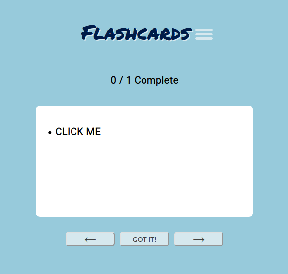
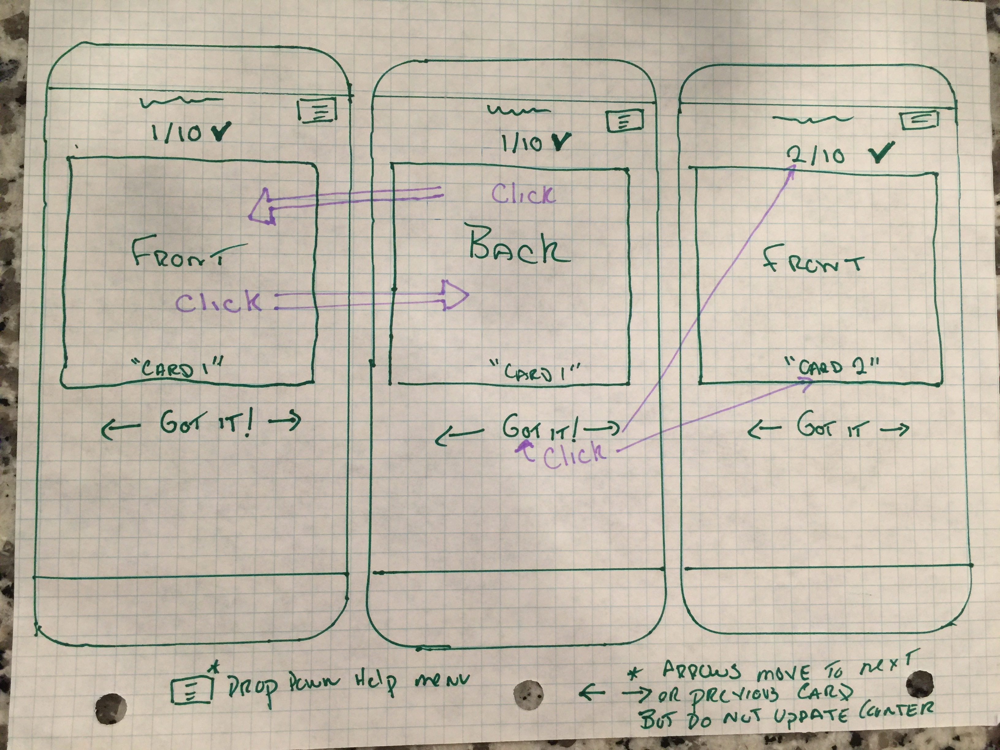

# Flashcards

## Screen Shots


## Technologies Used
#### HTML
#### CSS
#### Javascript

## Instillation Instructions
#### Fork and clone the repository
#### Open the folder with your favorite code editor to edit or launch with live server or by opening the index.html file

## User Stories
#### My user is anyone that studies using flashcards or is intersed in learning new words via flashcards.
- As a user,  I would like flashcards that flip front and back so I can test my self and only reveal definitions when I need them.
- As a user, I want to click on the cards to have them flip as well as use the arrow keys so I can move through the cards and flip them quickly.
- As a user, I would like some pre-loaded cards so I do not have to create content if I don't want to.- 
- As a user, I want to be able to mark which cards I got right/know so I they can be removed from the cycle and I can focus on the cards I do not know.
- As a user, I would like cards that I don’t know to re-display until I get them right so that I can be confident I know the material. 
- As a user, I would like to know how many cards I have gotten right/know so far and how many cards are in the current deck so I can gauge how many I know out of  section
- As a user , I would like to be able to load random vocabulary flashcards so I can study a new set each time a dictionary api to populate a stack of random vocabulary cards create a score and deck size counter
- As a user, I would like to be able to make my own flash cards so I can study what I want
- As a user, I would like a help Icon so if I get confuse I can click on it for incrustations 
- As a user, I would like to be able to load cards from different categories so I can narrow down my studying with out being forced to create all the cards myself.
- As a user, I  would like to be able to make my own cards so that I can study my own material.
- As a user, I would like a screen that lets me select card different card categories and options so that the interface is intuitive and good looking
## Wireframes

## Hurdles 
#### Next and previous card issue.
###### The cards are stored as object in an array. Currently, each card has three key value pairs: title, def, completed. Cards with a completed value of true are no longer displayed as you move though the deck. This is accomplished by moving to the next card if cards.completed = true until you reach a card that has a cards.completed = false. 

```
function moveToNextUncompletedCard(){
  do {
    cardIndex += 1;
  } while (cards[cardIndex].completed === true);
  }
}
```

This creates an unintended side affect. If all cards after your current position we completed = true, the function would move you until cards.completed was not true. Where is that you may ask if all cards after are true? This would be at cards.length + 1 because at this position cards is undefined. If cards is undefined then cards.completed does not equal true. So if you used the next button when you had all the cards following as true, you would get an undifined error in the console and create issues with the index of the array.

There is a more efficient solution but for now I create a temporary array for all items after the current index and then check if every cards.completed = true for all the cards in this temporary array. 
```
function moveToNextUncompletedCard(){
  let tempArray = [...cards].splice(cardIndex + 1, cards.length);
    if (tempArray.every(isCompleted)) {
      return;
    } else {
      do {
        cardIndex += 1;
       } while (cards[cardIndex].completed === true);
   }
}


```
These issues were the same for the previous button and solved with the same general solution. 

## Ideas for Additions
- Alert to let the user know a word was added when using the random word, search word, or create functions. Currently when you click submit or the random word button it is hard to tell if anything actually happened and users may click multiple times. Visual response is needed to let the users know there click performed and action.
- Move to next available card when "got it" button is pressed.
- Make the menu title tabs clickable and not just the text clickable.
- Work on refining HTML markup for increase accessibility

## Link
### https://d-e-k-k.github.io/flash-cards/
